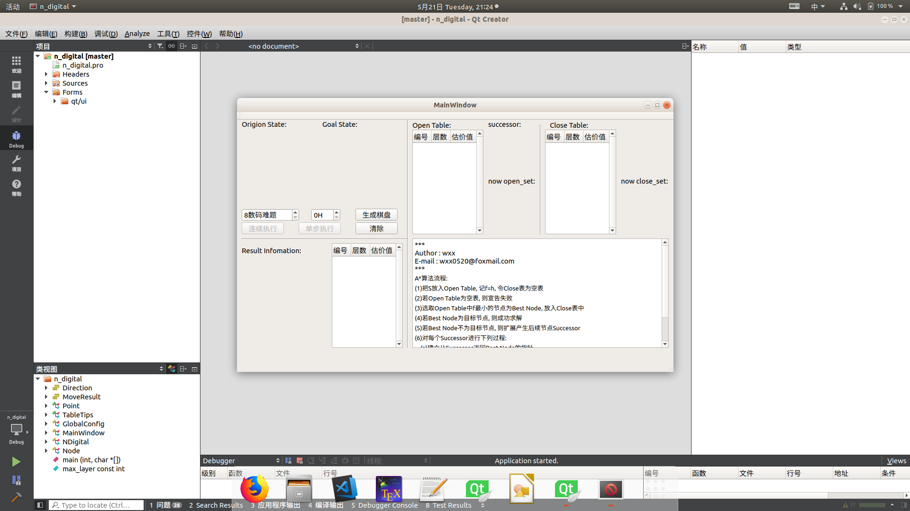
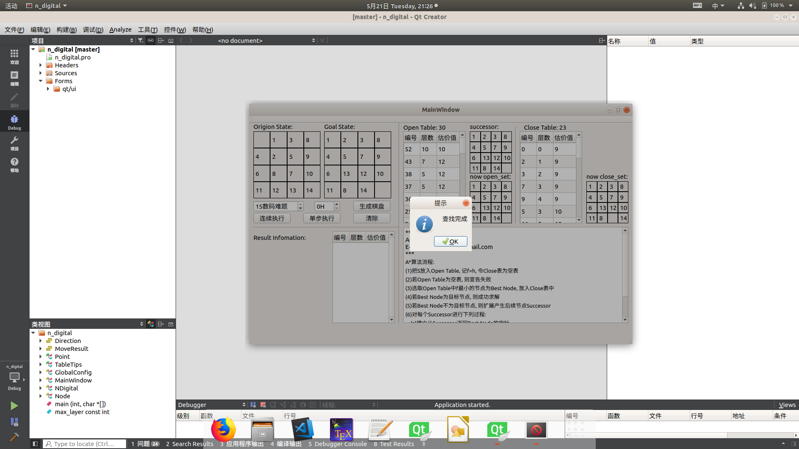
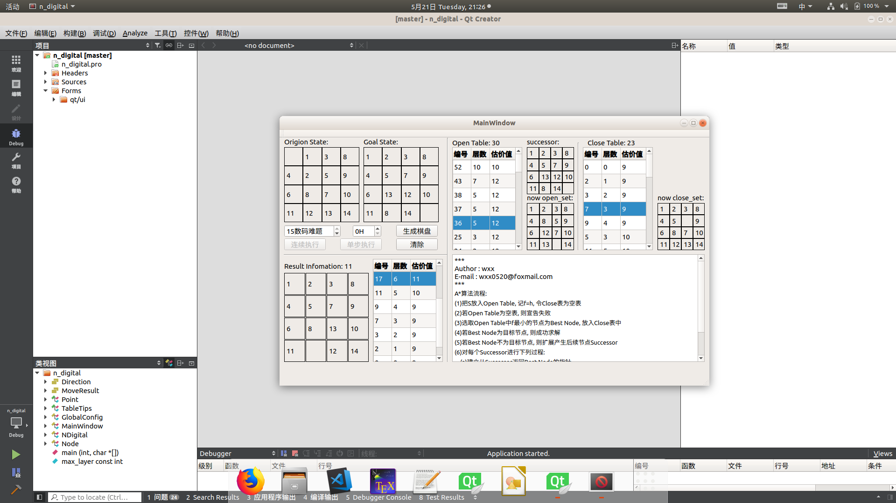

# n_digital

# 算法流程  
> A*算法流程:  
> 1. 把S放入Open Table, 记f=h, 令Close表为空表  
> 2. 若Open Table为空表, 则宣告失败  
> 3. 选取Open Table中f最小的节点为Best Node, 放入Close表中  
> 4. 若Best Node为目标节点, 则成功求解  
> 5. 若Best Node不为目标节点, 则扩展产生后续节点  Successor  
> 6. 对每个Successor进行下列过程:  
>    a. 建立从Successor返回Best Node的指针  
>    b. 计算f(Successor)  
>    c. 按升序添加至Open Table中  

# 运行过程
> 初始界面:  
>   
>   
> 可以选择n数码维度和估价函数的计算方式.  
> 生成棋盘,可以选择单步执行和连续执行.  
>   
>  如果找到解, 则返回查找完成, 若无界则返回无解. 有解时会出现,Open表, Close表, 结果表, 并可以通过点击表中元素查处元素对应状态.  
>   

# 博客推荐
> [八数码问题](https://www.cnblogs.com/guanghe/p/5485816.html)  
> [A*算法](https://www.cnblogs.com/mingbujian/p/4915546.html)  